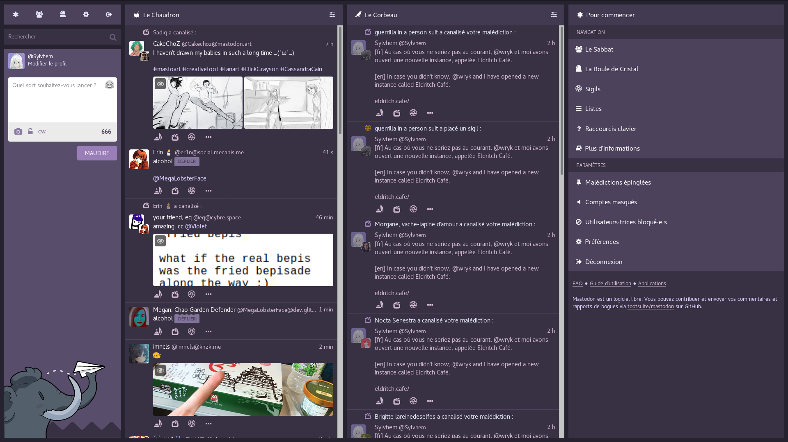

# Witches Town's theme
A purple theme for [Mastodon](https://github.com/tootsuite/mastodon).

It was originally created by [Alda](https://github.com/Aldarone) for [Witches Town](https://github.com/WitchesTown/) but is now used by various other instances.

## Setup
### Instance admins
1. Copy `witches-town.scss` into `app/javascript/styles/` and `witchesAwesome` into `public/`.
2. Add the following line in `config/themes.yml`: `witches-town: styles/witches-town.scss`.
3. Restart Mastodon.

### Users
Once the theme have been installed on your instance.
1. Go to the `Preferences` panel.
2. Look for the `Site theme` dropdown menu.
3. Select the `witches-town` theme from it.
4. Save changes.

## Licence
Copyright (C) 2017-2018 Alda Marteau-Hardi & other contributors.

This program is free software: you can redistribute it and/or modify it under the terms of the GNU Affero General Public License as published by the Free Software Foundation, either version 3 of the License, or (at your option) any later version.

This program is distributed in the hope that it will be useful, but WITHOUT ANY WARRANTY; without even the implied warranty of MERCHANTABILITY or FITNESS FOR A PARTICULAR PURPOSE. See the GNU Affero General Public License for more details.

You should have received a copy of the GNU Affero General Public License along with this program. If not, see https://www.gnu.org/licenses/.
